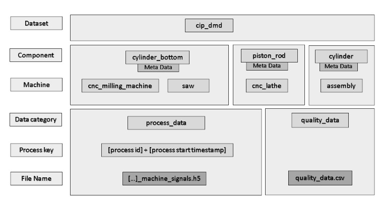

# CiP Discrete Manufacturing Dataset

## ToDo:
in the current dataset meta data version, piston rod process data and quality data paths are not yet stored in a list while the documentation and aquisition code here already store them in lists
## Download

Download the dataset from:

https://cloud.ptw-darmstadt.de/index.php/s/5UFhiEZAfRZP0De (temporary link)

## Dataset Structure

The data is sorted in hierarchical folder structure, as shown in the image below.
	 
 

- **Components**:
    - *piston_rod* - machined by CNC lathe
    - *cylinder bottom* - cut by saw and then machined by CNC milling machine
    - *cylinder* -  contain a piston rod and a cylinder bottom each as subparts
- **Meta data**: Makes relations between components and corresponding data easy to access. For further information please see section "Meta Data".
- **Machine**:
    - CNC lathe
    - Saw
    - CNC milling machine
- **Data categories**:
    - *process_data* was collected during machining, either from the machine itself or from external sensors.
    - *quality_data* contains measurement data collected after the respective processing step.
- **Process keys**: 
    - In *process_data*, each folder corresponds to a processing step of an individual component. Folder names are composed of process id and start time, like *100102_11_29_2022_12_40_48*.
    - *quality_data*  files contain all data of a process type in one file
	
- **File Names**:
    - Process data:
        - *cnc_milling_machine*:
            - *frontside_internal_machine_signals.h5*
            - *backside_internal_machine_signals.h5*
            - *frontside_external_sensor_signals.h5*
            - *backside_external_sensor_signals.h5*
            - *frontside_timestamp_process_pairs.csv*
            - *backside_timestamp_process_pairs.csv*
            - *frontside_face_milling_spike_data.h5*
            - *frontside_outer_contour_roughing_and_finishing_spike_data.h5*
            - *backside_circular_pocket_milling_spike_data.h5*
            - *backside_face_milling_spike_data.h5*
            - *backside_lateral_groove_spike_data.h5*
            - Please note that spike sensor signals are only provided for some processes
        - *saw*: internal_machine_signals.h5
        - *cnc_lathe*: internal_machine_signals.h5
    - Quality data files are called *quality_data.csv*.

## Anomaly classes

Two of the most common errors causing faulty cylinder bottoms in our process have been intentionally provoked during data collection. Anomly classes are stored in the meta data of a component.

- **0** : Normal process
- **1** : Raw cutting material was badly aligned at the saw
    - Anomalous sawing process (raw cylinder bottom cut too short)
    - Anomalous milling proces
- **2** : Part was unevenly clamped in the milling jig
    - Anomalous milling process
- **3** : Miscellaneous errors happened during the process that are not visible in process data

## Meta data

Meta data is stored in json format and contains component-specific information about:
- All *process_data*  connected to this component:
    - Path to process data file
    - Process start and end time
- All *quality_data* connected to this component:
    - Measurement data
    - *qc_pass* : Whether component measurement is within bounds of quality check
- *anomaly* : Anomaly class
- *component_ids* : Subparts that the dataset contains information about

Below is shown an example of a meta data entry for a piston rod:

    {
        "part_type": "piston_rod",
        "part_id": "200201",
        "component_ids": [],
        "process_data": [{
        "data_paths": [
            "piston_rod/cnc_lathe/process_data/200201_9_6_2022_11_33_24/internal_machine_signals.h5"
        ],
        "start_time": 1662456804.108042,
        "end_time": 1662456875.893439,
        "name": "cnc_lathe",
        "anomaly": 0
        }],
        "quality_data": [{
        "process": "cnc_lathe",
        "measurements": [
            {
            "feature": "coaxiality",
            "value": "14.9",
            "qc_pass": true
            },
            {
            "feature": "diameter",
            "value": "0.008",
            "qc_pass": true
            },
            {
            "feature": "length",
            "value": "163.671",
            "qc_pass": true
            }
        ]
        }]
    },
## Accessing data

Data collected from spike sensors is stored as hdf5 individual datasets with field names as keys.

All other process data is stored in single hdf5 datasets with key *data*. Column names can be accessed by calling *.attrs["column_names"]* on the dataset:

	with h5py.File('internal_machine_signals.h5', 'r') as hf:
		data = hf["data"]
		column_names = hf['data'].attrs["column_names"]
	
Data is stored with time progressing in first and data field index progressing in second dimension:
	
	column_index = 14
	plt.plot(data[: , column_index])
	
To collect all process data in a directory:
	
	BASEPATH = 'Z:\cip_dmd\piston_rod\\cnc_lathe\\process_data'
	subdirs = [f.path for f in os.scandir(BASEPATH) if f.is_dir()]
	data_list = []
	for subdir in subdirs:
		with h5py.File(os.path.join(BASEPATH, subdir, 'internal_machine_signals.h5'), 'r') as hf:
			data_list.append(hf['data'][:])
			
			
